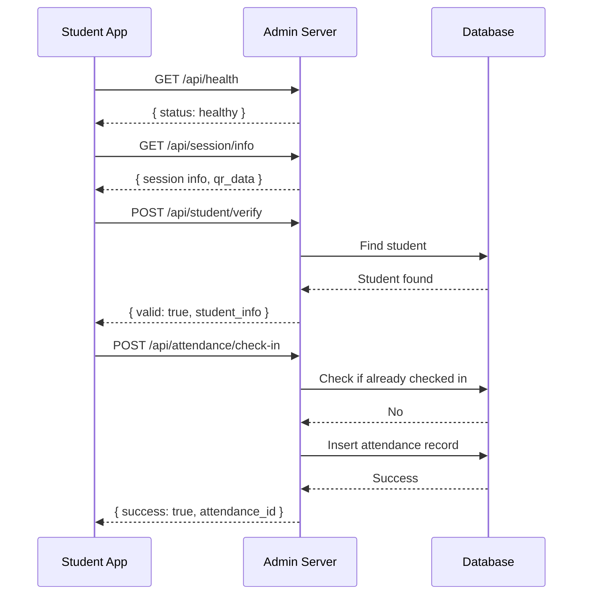
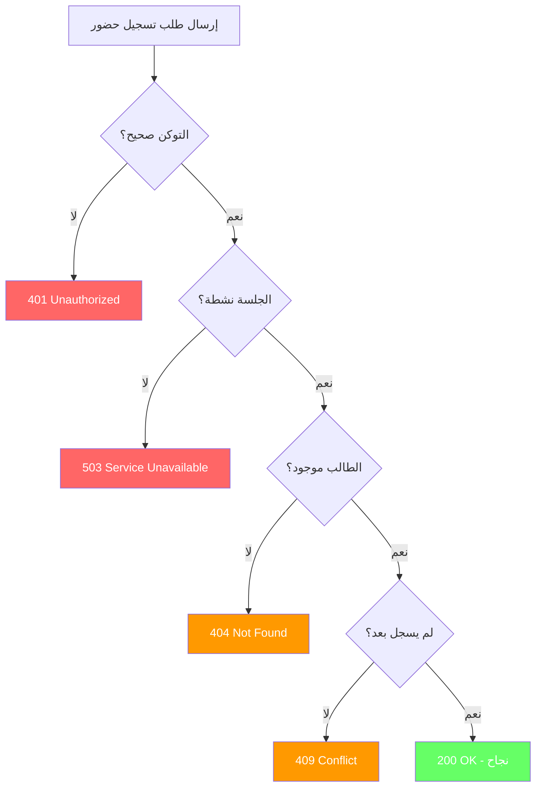

# 🌐 توثيق HTTP Server API

<p align="center">
  <strong>واجهة برمجة التطبيقات لنظام الحضور الذكي</strong>
</p>

---

## 📋 جدول المحتويات

- [نظرة عامة](#-نظرة-عامة)
- [Base URL](#-base-url)
- [المصادقة](#-المصادقة)
- [Endpoints](#-endpoints)
  - [تسجيل الحضور (POST /api/attendance/check-in)](#1--post-apiattendancecheck-in)
  - [معلومات الجلسة (GET /api/session/info)](#2--get-apisessioninfo)
  - [حالة الجلسة (GET /api/session/status)](#3--get-apisessionstatus)
  - [التحقق من طالب (POST /api/student/verify)](#4--post-apistudentverify)
  - [فحص الصحة (GET /api/health)](#5--get-apihealth)
- [أكواد الخطأ](#-أكواد-الخطأ)
- [أمثلة الاستخدام](#-أمثلة-الاستخدام)

---

## 👁️ نظرة عامة

يعمل تطبيق **Admin** كـ **خادم HTTP محلي** يستقبل طلبات تسجيل الحضور من أجهزة الطلاب عبر شبكة Wi-Fi المحلية. يستخدم الخادم بروتوكول **HTTP/1.1** مع دعم **CORS** للسماح بالطلبات المتقاطعة.

### المميزات التقنية

| الميزة | الوصف |
|--------|-------|
| **Protocol** | HTTP/1.1 |
| **Data Format** | JSON |
| **Encoding** | UTF-8 |
| **CORS** | مدعوم بالكامل (*) |
| **Authentication** | Token-based (Session Token) |
| **Max Connections** | 100 اتصال متزامن |
| **Request Timeout** | 30 ثانية |

---

## 🔗 Base URL

```
http://{ip}:{port}
```

### المعاملات

| المعامل | الوصف | مثال |
|---------|-------|------|
| `{ip}` | عنوان IP للجهاز الذي يشغل Admin App | `192.168.1.100` |
| `{port}` | رقم المنفذ (افتراضي: 8080) | `8080` |

### أمثلة

```
# عنوان كامل
http://192.168.1.100:8080

# على localhost للتطوير
http://127.0.0.1:8080
```

---

## 🔐 المصادقة

يستخدم النظام **Session Token** للمصادقة. يتم توليد التوكن عند إنشاء كل جلسة جديدة ويجب إرساله مع طلبات الحضور.

### Header للمصادقة

```http
Content-Type: application/json
Authorization: Bearer {session_token}
```

> **⚠️ ملاحظة:** يتم إرسال التوكن في body الطلب وليس في Header لتسهيل الاستخدام.

---

## 📡 Endpoints

---

### 1. 📥 POST `/api/attendance/check-in`

تسجيل حضور طالب في جلسة نشطة.

#### Endpoint Details

| الخاصية | القيمة |
|---------|--------|
| **Method** | `POST` |
| **URL** | `/api/attendance/check-in` |
| **Content-Type** | `application/json` |
| **Authentication** | مطلوب (Session Token) |

#### Request Body

```json
{
  "student_id": "STU20240001",
  "session_token": "abc123xyz789",
  "device_id": "unique_device_id_123",
  "hash": "sha256_hash_of_request"
}
```

#### Fields Description

| الحقل | النوع | مطلوب | الوصف |
|-------|------|-------|-------|
| `student_id` | String | ✅ نعم | معرف الطالب الفريد |
| `session_token` | String | ✅ نعم | توكن الجلسة النشطة |
| `device_id` | String | ❌ لا | معرف جهاز الطالب (للتتبع) |
| `hash` | String | ❌ لا | تجزئة التحقق من سلامة البيانات |

#### Response Success (200 OK)

```json
{
  "success": true,
  "message": "تم تسجيل الحضور بنجاح",
  "data": {
    "attendance_id": "att_123456",
    "student_id": "STU20240001",
    "student_name": "أحمد محمد علي",
    "timestamp": "2024-01-15T09:30:00.000Z",
    "status": "present"
  },
  "timestamp": "2024-01-15T09:30:00.500Z"
}
```

#### Response Error Examples

**401 Unauthorized - توكن غير صالح:**

```json
{
  "success": false,
  "error": "غير مصرح لك بالوصول",
  "timestamp": "2024-01-15T09:30:00.000Z"
}
```

**409 Conflict - تم التسجيل مسبقاً:**

```json
{
  "success": false,
  "error": "تم تسجيل الحضور مسبقاً لهذا الطالب",
  "timestamp": "2024-01-15T09:30:00.000Z"
}
```

**503 Service Unavailable - الجلسة مغلقة:**

```json
{
  "success": false,
  "error": "تم إغلاق هذه الجلسة",
  "timestamp": "2024-01-15T09:30:00.000Z"
}
```

#### Example Request (cURL)

```bash
curl -X POST http://192.168.1.100:8080/api/attendance/check-in \
  -H "Content-Type: application/json" \
  -d '{
    "student_id": "STU20240001",
    "session_token": "abc123xyz789",
    "device_id": "device_001"
  }'
```

#### Example Request (JavaScript/Fetch)

```javascript
const response = await fetch('http://192.168.1.100:8080/api/attendance/check-in', {
  method: 'POST',
  headers: {
    'Content-Type': 'application/json',
  },
  body: JSON.stringify({
    student_id: 'STU20240001',
    session_token: 'abc123xyz789',
    device_id: 'device_001'
  })
});

const data = await response.json();
console.log(data);
```

#### Example Request (Python/Requests)

```python
import requests

response = requests.post(
    'http://192.168.1.100:8080/api/attendance/check-in',
    json={
        'student_id': 'STU20240001',
        'session_token': 'abc123xyz789',
        'device_id': 'device_001'
    }
)

print(response.json())
```

---

### 2. 📋 GET `/api/session/info`

الحصول على معلومات الجلسة النشطة.

#### Endpoint Details

| الخاصية | القيمة |
|---------|--------|
| **Method** | `GET` |
| **URL** | `/api/session/info` |
| **Authentication** | اختياري |

#### Query Parameters

لا يوجد parameters مطلوبة.

#### Response Success (200 OK)

```json
{
  "success": true,
  "data": {
    "session_id": "sess_123456",
    "course_name": "برمجة متقدمة",
    "section_name": "الشعبة أ",
    "instructor_name": "د. محمد أحمد",
    "date": "2024-01-15",
    "start_time": "09:00:00",
    "end_time": "11:00:00",
    "status": "active",
    "attendance_count": 25,
    "total_students": 35,
    "qr_data": "https://example.com/checkin?token=abc123"
  },
  "timestamp": "2024-01-15T10:00:00.000Z"
}
```

#### Response Fields

| الحقل | النوع | الوصف |
|-------|------|-------|
| `session_id` | String | معرف الجلسة |
| `course_name` | String | اسم المقرر |
| `section_name` | String | اسم الشعبة |
| `instructor_name` | String | اسم المحاضر |
| `date` | String | تاريخ الجلسة (YYYY-MM-DD) |
| `start_time` | String | وقت البدء (HH:mm:ss) |
| `end_time` | String | وقت الانتهاء (HH:mm:ss) |
| `status` | String | حالة الجلسة (created/active/paused/closed) |
| `attendance_count` | int | عدد الحاضرين |
| `total_students` | int | إجمالي الطلاب |
| `qr_data` | String | بيانات رمز QR |

#### Example Request (cURL)

```bash
curl http://192.168.1.100:8080/api/session/info
```

---

### 3. 📊 GET `/api/session/status`

الحصول على حالة الجلسة الحالية (مختصر).

#### Endpoint Details

| الخاصية | القيمة |
|---------|--------|
| **Method** | `GET` |
| **URL** | `/api/session/status` |
| **Authentication** | اختياري |

#### Response Success (200 OK)

```json
{
  "success": true,
  "data": {
    "is_running": true,
    "has_active_session": true,
    "session_id": "sess_123456",
    "connected_count": 5,
    "uptime_seconds": 3600,
    "timestamp": "2024-01-15T10:00:00.000Z"
  }
}
```

#### Response Fields

| الحقل | النوع | الوصف |
|-------|------|-------|
| `is_running` | Boolean | هل الخادم يعمل؟ |
| `has_active_session` | Boolean | هل توجد جلسة نشطة؟ |
| `session_id` | String | معرف الجلسة (إن وجدت) |
| `connected_count` | int | عدد الأجهزة المتصلة |
| `uptime_seconds` | int | مدة تشغيل الخادم بالثواني |

#### Use Cases

- فحص توفر الخادم قبل محاولة تسجيل الحضور
- عرض حالة الاتصال في واجهة المستخدم
- مراقبة أداء الخادم

#### Example Request (cURL)

```bash
curl http://192.168.1.100:8080/api/session/status
```

---

### 4. ✅ POST `/api/student/verify`

التحقق من وجود طالب مسجل في النظام.

#### Endpoint Details

| الخاصية | القيمة |
|---------|--------|
| **Method** | `POST` |
| **URL** | `/api/student/verify` |
| **Content-Type** | `application/json` |
| **Authentication** | اختياري |

#### Request Body

```json
{
  "student_id": "STU20240001"
}
```

#### Fields Description

| الحقل | النوع | مطلوب | الوصف |
|-------|------|-------|-------|
| `student_id` | String | ✅ نعم | معرف الطالب للتحقق منه |

#### Response Success (200 OK) - طالب موجود:

```json
{
  "success": true,
  "data": {
    "valid": true,
    "student_id": "STU20240001",
    "student_name": "أحمد محمد علي",
    "department": "علوم الحاسب",
    "level": 3,
    "section": "الشعبة أ",
    "timestamp": "2024-01-15T09:29:00.000Z"
  }
}
```

#### Response Success (200 OK) - طالب غير موجود:

```json
{
  "success": true,
  "data": {
    "valid": false,
    "student_id": "STU99999999",
    "timestamp": "2024-01-15T09:29:00.000Z"
  }
}
```

#### Use Cases

- التحقق من صحة معرف الطالب قبل تسجيل الحضور
- عرض معلومات الطالب للتأكيد
- التحقق من صحة QR Code الممسوح

#### Example Request (cURL)

```bash
curl -X POST http://192.168.1.100:8080/api/student/verify \
  -H "Content-Type: application/json" \
  -d '{"student_id": "STU20240001"}'
```

---

### 5. ❤️ GET `/api/health`

فحص صحة الخادم والخدمة.

#### Endpoint Details

| الخاصية | القيمة |
|---------|--------|
| **Method** | `GET` |
| **URL** | `/api/health` |
| **Authentication** | غير مطلوب |

#### Response Success (200 OK)

```json
{
  "success": true,
  "data": {
    "status": "healthy",
    "service": "Attendance Admin API",
    "version": "1.0.0",
    "is_running": true,
    "connected_clients": 5,
    "uptime_seconds": 3600,
    "timestamp": "2024-01-15T10:00:00.000Z"
  }
}
```

#### Response Fields

| الحقل | النوع | الوصف |
|-------|------|-------|
| `status` | String | حالة الخادم (healthy/degraded/unhealthy) |
| `service` | String | اسم الخدمة |
| `version` | String | إصدار API |
| `is_running` | Boolean | هل الخادم يعمل؟ |
| `connected_clients` | int | عدد العملاء المتصلين |
| `uptime_seconds` | int | مدة التشغيل بالثواني |

#### Use Cases

- فحص توفر الخادم (Health Check)
- Monitoring و Alerting
- Load Balancer checks

#### Example Request (cURL)

```bash
curl http://192.168.1.100:8080/api/health
```

---

## ⚠️ أكواد الخطأ

### HTTP Status Codes

| الكود | المعنى | الوصف |
|-------|--------|-------|
| **200** | OK | الطلب ناجح |
| **201** | Created | تم الإنشاء بنجاح |
| **400** | Bad Request | طلب غير صحيح |
| **401** | Unauthorized | غير مصرح (توكن غير صالح) |
| **403** | Forbidden | ممنوع الوصول |
| **404** | Not Found | Endpoint غير موجود |
| **405** | Method Not Allowed | طريقة الطلب غير مدعومة |
| **409** | Conflict | تعارض في البيانات (تسجيل مكرر) |
| **422** | Unprocessable Entity | بيانات غير صالحة |
| **429** | Too Many Requests | طلبات كثيرة جداً (Rate Limit) |
| **500** | Internal Server Error | خطأ داخلي في الخادم |
| **503** | Service Unavailable | الخادم غير متاح (الجلسة مغلقة) |

### Application Error Codes

| الكود | الرسالة (AR) | الرسالة (EN) | الحل |
|-------|--------------|--------------|------|
| `AUTH_ERROR` | غير مصرح لك بالوصول | Unauthorized | تحقق من Session Token |
| `SESSION_CLOSED` | تم إغلاق هذه الجلسة | Session closed | تأكد أن الجلسة نشطة |
| `ALREADY_CHECKED_IN` | تم تسجيل الحضور مسبقاً | Already checked in | لا يمكن التسجيل مرتين |
| `STUDENT_NOT_FOUND` | الطالب غير موجود | Student not found | تأكد من معرف الطالب |
| `INVALID_QR_CODE` | رمز QR غير صالح | Invalid QR Code | امسح QR صحيح |
| `NETWORK_ERROR` | خطأ في الاتصال بالشبكة | Network error | تحقق من اتصال الشبكة |
| `SERVER_ERROR` | خطأ في الخادم الداخلي | Server error | حاول مرة أخرى لاحقاً |
| `VALIDATION_ERROR` | بيانات غير صحيحة | Validation error | تحقق من البيانات المدخلة |
| `DUPLICATE_ENTRY` | هذه البيانات موجودة مسبقاً | Duplicate entry | استخدم بيانات مختلفة |

### Error Response Format

جميع الأخطاء تُرجع بنفس التنسيق:

```json
{
  "success": false,
  "error": "رسالة الخطأ",
  "error_code": "ERROR_CODE",
  "details": "تفاصيل إضافية (اختياري)",
  "timestamp": "2024-01-15T10:00:00.000Z"
}
```

---

## 💡 أمثلة الاستخدام

### سيناريو كامل: تسجيل حضور طالب



### سيناريو: التعامل مع الأخطاء



---

## 🔒 CORS Configuration

يدعم الخادم CORS بالتكوين التالي:

```http
Access-Control-Allow-Origin: *
Access-Control-Allow-Methods: GET, POST, OPTIONS
Access-Control-Allow-Headers: Origin, Content-Type, Accept, Authorization
Access-Control-Max-Age: 86400
```

> **💡 ملاحظة:** يسمح بجميع Origins للتطوير المحلي. في الإنتاج، قم بتقييد هذا.

---

## 📊 Rate Limiting

| الحد | القيمة |
|------|--------|
| **Max Connections** | 100 متزامن |
| **Request Timeout** | 30 ثانية |
| **Rate Limit** | غير مفعل حالياً (يمكن إضافته) |

---

## 🧪 Testing Endpoints

### باستخدام Postman

1. إنشاء Collection جديد
2. إضافة Requests لكل endpoint
3. استخدام Environment Variables:
   ```
   {{base_url}} = http://192.168.1.100:8080
   {{session_token}} = your_token_here
   ```

### باستخدام HTTPie

```bash
# فحص الصحة
http GET :8080/api/health

# حالة الجلسة
http GET :8080/api/session/status

# تسجيل حضور
http POST :8080/api/attendance/check-in \
  student_id="STU001" \
  session_token="TOKEN"

# التحقق من طالب
http POST :8080/api/student/verify \
  student_id="STU001"
```

---

<p align="center">
  <strong>🎯 انتهى توثيق API</strong>
</p>
