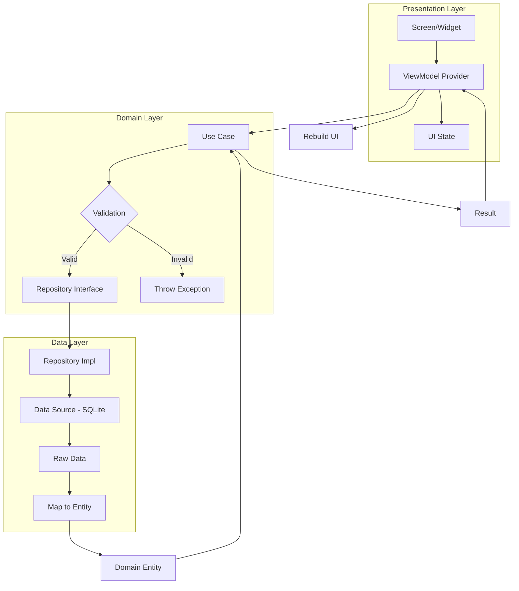

# 🏗️ وثيقة العمارة التقنية

<p align="center">
  <strong>شرح معمارية نظام الحضور الذكي - Clean Architecture</strong>
</p>

---

## 📋 جدول المحتويات

- [نظرة عامة](#-نظرة-عامة)
- [المبادئ الأساسية](#-المبادئ-الأساسية)
- [Clean Architecture](#-clean-architecture)
  - [طبقات العمارة](#-طبقات-العمارة)
  - [قواعد الاعتماد](#-قواعد-الاعتماد)
- [MVVM Pattern](#-mvvm-pattern)
- [Dependency Injection (Riverpod)](#-dependency-injection-riverpod)
- [Repository Pattern](#-repository-pattern)
- [هيكل المشروع التفصيلي](#-هيكل-المشروع-التفصيلي)
- [تدفق البيانات](#-تدفق-البيانات)
- [إدارة الحالة](#-إدارة-الحالة)

---

## 👁️ نظرة عامة

يتبع نظام **الحضور الذكي** نمط **Clean Architecture** مع **MVVM** لإدارة الواجهة، ويستخدم **Riverpod** لـ **Dependency Injection** وإدارة الحالة. هذا التصميم يضمن:

- ✅ **فصل المسؤوليات**: كل طبقة مسؤولة عن مهمة محددة
- ✅ **قابلية الاختبار**: سهولة كتابة Unit Tests
- ✅ **مرونة التغيير**: تغيير جزء دون تأثير على الآخر
- ✅ **قابلية التوسع**: إضافة ميزات بسهولة
- ✅ **صيانة سهولة**: كود منظم ومفهوم

---

## 📐 المبادئ الأساسية

### SOLID Principles

| المبدأ | التطبيق في المشروع |
|--------|-------------------|
| **S** - Single Responsibility | كل class/file له مسؤولية واحدة |
| **O** - Open/Closed | فتح للإغلاق عبر Interfaces |
| **L** - Liskov Substitution | Repositories قابلة للتبديل |
| **I** - Interface Segregation | interfaces صغيرة ومحددة |
| **D** - Dependency Inversion | الاعتماد على Abstractions |

### مبدأ العزل (Separation of Concerns)

```
┌─────────────────────────────────────────────────────┐
│                    Presentation                      │
│              (UI - Screens & Widgets)                │
│                   "ماذا يُعرض؟"                       │
├─────────────────────────────────────────────────────┤
│                     Domain                           │
│           (Business Logic & Rules)                  │
│                 "ماذا نفعل؟"                         │
├─────────────────────────────────────────────────────┤
│                      Data                            │
│         (Data Sources & APIs)                        │
│               "من أين نحصل على البيانات؟"            │
└─────────────────────────────────────────────────────┘
```

---

## 🏛️ Clean Architecture

### طبقات العمارة

```
┌─────────────────────────────────────────────────────────────────┐
│                         PRESENTATION                             │
│  ┌──────────┐  ┌──────────┐  ┌──────────┐  ┌──────────────────┐ │
│  │  Screens │  │ Widgets  │  │  ViewModels│  │   App Router    │ │
│  └──────────┘  └──────────┘  └──────────┘  └──────────────────┘ │
├─────────────────────────────────────────────────────────────────┤
│                           DOMAIN                                 │
│  ┌──────────────┐  ┌─────────────┐  ┌────────────────────────┐  │
│  │   Entities   │  │ Use Cases   │  │   Repositories (Abs)   │  │
│  └──────────────┘  └─────────────┘  └────────────────────────┘  │
├─────────────────────────────────────────────────────────────────┤
│                            DATA                                  │
│  ┌──────────────┐  ┌─────────────┐  ┌────────────────────────┐  │
│  │   Models     │  │Repositories│  │   Data Sources          │  │
│  │  (Drift)     │  │  (Impl)     │  │   (Local DB, API)      │  │
│  └──────────────┘  └─────────────┘  └────────────────────────┘  │
├─────────────────────────────────────────────────────────────────┤
│                          CORE / SHARED                            │
│  ┌──────────┐  ┌──────────┐  ┌──────────┐  ┌────────────────┐   │
│  │ Constants│  │  Utils   │  │  Theme   │  │ DI (Providers) │   │
│  └──────────┘  └──────────┘  └──────────┘  └────────────────┘   │
│  ┌──────────┐  ┌──────────┐  ┌──────────┐  ┌────────────────┐   │
│  │ Router   │  │Extensions│  │ Services │  │ Error Handling │   │
│  └──────────┘  └──────────┘  └──────────┘  └────────────────┘   │
└─────────────────────────────────────────────────────────────────┘
```

### تفصيل كل طبقة

#### 1. 📱 Presentation Layer (طبقة العرض)

**المسؤوليات:**
- عرض البيانات للمستخدم
- استقبال تفاعلات المستخدم
- التنقل بين الشاشات
- إدارة حالة الـ UI

**المكونات:**

```
lib/presentation/
├── screens/                    # شاشات التطبيق
│   ├── splash_screen.dart     # شاشة البداية
│   ├── login_screen.dart      # تسجيل الدخول
│   ├── main_screen.dart       # الهيكل الرئيسي (Shell)
│   ├── dashboard_screen.dart  # لوحة التحكم
│   ├── student_list_screen.dart
│   ├── session_create_screen.dart
│   └── ...
├── widgets/                    # Widgets قابلة لإعادة الاستخدام
│   ├── common/
│   └── form/
└── providers/                  # ViewModels (Riverpod Providers)
    ├── auth_provider.dart
    ├── dashboard_provider.dart
    └── ...
```

#### 2. 🧠 Domain Layer (طبقة المنطق)

**المسؤوليات:**
- قواعد العمل (Business Logic)
- الكيانات (Entities)
- حالات الاستخدام (Use Cases)
- تعريف المستودعات (Repository Interfaces)

> **ملاحظة هامة:** هذه الطبقة **لا تعتمد** على أي إطار عمل أو مكتبة خارجية.

**المكونات:**

```
lib/domain/
├── entities/                   # الكيانات النقية (Pure Objects)
│   └── entities.dart
│       ├── StudentEntity
│       ├── AttendanceEntity
│       ├── SessionEntity
│       ├── DepartmentEntity
│       ├── SectionEntity
│       ├── CourseEntity
│       └── LevelEntity
│
├── repositories/               # واجهات المستودعات (Abstract)
│   └── repositories.dart
│       ├── StudentRepository (abstract)
│       ├── AttendanceRepository (abstract)
│       ├── SessionRepository (abstract)
│       ├── DepartmentRepository (abstract)
│       ├── SectionRepository (abstract)
│       └── CourseRepository (abstract)
│
└── use_cases/                  # حالات الاستخدام
    └── use_cases.dart
        ├── GetAllStudentsUseCase
        ├── SearchStudentsUseCase
        ├── AddStudentUseCase
        ├── CheckInUseCase
        ├── CreateSessionUseCase
        ├── ActivateSessionUseCase
        ├── GetDashboardStatsUseCase
        └── ...
```

#### 3. 💾 Data Layer (طبقة البيانات)

**المسؤوليات:**
- التعامل مع مصادر البيانات
- تنفيذ المستودعات
- تحويل البيانات (Mapping)
- التخزين المؤقت (Caching)

**المكونات:**

```
lib/data/
├── models/                     # نماذج البيانات (Drift Tables + Freezed)
│   ├── models.dart
│   ├── student_model.dart      # Drift Table + Freezed Model
│   ├── attendance_model.dart
│   ├── session_model.dart
│   ├── organization_models.dart
│   └── system_models.dart
│
├── data_sources/               # مصادر البيانات
│   └── local/
│       └── local_database.dart # Drift Database Definition
│
└── repositories/               # تنفيذ المستودعات
    ├── student_repository_impl.dart
    ├── attendance_repository_impl.dart
    └── session_repository_impl.dart
```

#### 4. ⚙️ Core Layer (الطبقة المشتركة)

**المسؤوليات:**
- الثوابت والإعدادات
- الأدوات المساعدة
- Dependency Injection
- التنقل (Routing)
- السمات (Theming)
- الخدمات الخارجية

**المكونات:**

```
lib/core/
├── constants/
│   └── app_constants.dart      # ثوابت التطبيق
├── di/
│   └── providers.dart          # Riverpod Providers
├── router/
│   └── app_router.dart         # Go Router Configuration
├── theme/
│   ├── app_theme.dart          # Theme Configuration
│   └── app_colors.dart         # Color Palette
├── extensions/
│   └── extensions.dart         # Dart Extensions
└── utils/
    └── app_utils.dart          # Helper Functions

lib/services/
├── database/
│   └── local_database.dart     # Database Service
├── encryption/
│   └── encryption_service.dart # Encryption Service
├── network/
│   └── http_server_service.dart # HTTP Server Service
├── notification/
│   └── notification_service.dart # Notification Service
└── storage/
    └── storage_service.dart    # Local Storage Service
```

---

### قواعد الاعتماد (Dependency Rule)

```
                    ┌─────────────────┐
                    │   PRESENTATION   │
                    └────────┬────────┘
                             │ يعتمد على
                             ▼
                    ┌─────────────────┐
                    │      DOMAIN     │ ◄── الطبقة المركزية (لا تعتمد على شيء)
                    └────────┬────────┘
                             │ يعتمد على
                             ▼
                    ┌─────────────────┐
                    │       DATA       │
                    └────────┬────────┘
                             │ يستخدم
                             ▼
                    ┌─────────────────┐
                    │   EXTERNAL LIBS  │
                    │  (Drift, Hive,   │
                    │   Shelf, etc.)   │
                    └─────────────────┘
```

**القاعدة الذهبية:**
> **الاعتمادات تتجها للداخل فقط.** الطبقات الخارجية تعتمد على الداخلية، وليس العكس.

---

## 🎭 MVVM Pattern

### المكونات

```
┌─────────────────────────────────────────────────────────────────┐
│                           VIEW                                   │
│  ┌─────────────────────────────────────────────────────────┐   │
│  │  Screen / Widget                                         │   │
│  │  - عرض البيانات                                          │   │
│  │  - استقبال تفاعلات المستخدم                              │   │
│  │  - إرسال الأحداث إلى ViewModel                           │   │
│  └────────────────────────┬────────────────────────────────┘   │
└────────────────────────────┼────────────────────────────────────┘
                             │ observes / watches
                             ▼
┌─────────────────────────────────────────────────────────────────┐
│                        VIEWMODEL                                 │
│  ┌─────────────────────────────────────────────────────────┐   │
│  │  Riverpod Provider / StateNotifier                        │   │
│  │  - إدارة حالة UI                                          │   │
│  │  - استدعاء Use Cases                                      │   │
│  │  - تحويل البيانات للعرض                                    │   │
│  │  - معالجة الأخطاء                                         │   │
│  └────────────────────────┬────────────────────────────────┘   │
└────────────────────────────┼────────────────────────────────────┘
                             │ uses
                             ▼
┌─────────────────────────────────────────────────────────────────┐
│                          MODEL                                  │
│  ┌─────────────────────────────────────────────────────────┐   │
│  │  Entity / Use Case / Repository                           │   │
│  │  - بيانات العمل                                          │   │
│  │  - قواعد العمل                                           │   │
│  │  - الوصول للبيانات                                       │   │
│  └─────────────────────────────────────────────────────────┘   │
└─────────────────────────────────────────────────────────────────┘
```

### مثال عملي: MVVM في المشروع

```dart
// ============================================
// MODEL (Entity) - Domain Layer
// ============================================
class StudentEntity {
  final String id;
  final String name;
  final String studentId;
  
  const StudentEntity({
    required this.id,
    required this.name,
    required this.studentId,
  });
}

// ============================================
// VIEWMODEL (Provider) - Presentation Layer
// ============================================
class StudentListViewModel extends StateNotifier<StudentListState> {
  final GetAllStudentsUseCase _getAllStudentsUseCase;
  
  StudentListViewModel(this._getAllStudentsUseCase) 
    : super(const StudentListState.initial());
  
  Future<void> loadStudents() async {
    state = const StudentListState.loading();
    
    try {
      final students = await _getAllStudentsUseCase();
      state = StudentListState.loaded(students);
    } catch (e) {
      state = StudentListState.error(e.toString());
    }
  }
}

// ============================================
// VIEW (Screen) - Presentation Layer
// ============================================
class StudentListScreen extends ConsumerWidget {
  @override
  Widget build(BuildContext context, WidgetRef ref) {
    final viewModel = ref.watch(studentListProvider);
    final asyncStudents = ref.watch(studentListProvider);
    
    return asyncStudents.when(
      data: (students) => ListView.builder(
        itemCount: students.length,
        itemBuilder: (context, index) => StudentCard(student: students[index]),
      ),
      loading: () => const CircularProgressIndicator(),
      error: (error, _) => ErrorWidget(error: error),
    );
  }
}
```

---

## 💉 Dependency Injection (Riverpod)

### لماذا Riverpod؟

| الميزة | الوصف |
|--------|-------|
| **Compile-time Safety** | اكتشاف الأخطاء وقت الترجمة |
| **Testability** | سهولة استبدال Dependencies |
| **Auto-dispose** | تنظيف تلقائي للموارد |
| **No BuildContext** | يمكن استخدامه خارج Widgets |
| **Family Parameters** | إنشاء instances ديناميكية |

### هيكل Providers

```
lib/core/di/providers.dart
```

```dart
// ============================================
// Providers الأساسية (Singleton)
// ============================================

/// قاعدة البيانات
final databaseProvider = Provider<AppDatabase>((ref) {
  throw UnimplementedError('Database must be initialized in main.dart');
});

/// خدمة التخزين
final storageServiceProvider = Provider<StorageService>((ref) {
  throw UnimplementedError('StorageService must be initialized');
});

/// خدمة التشفير
final encryptionServiceProvider = Provider<EncryptionService>((ref) {
  return EncryptionService();
});

/// خدمة الإشعارات
final notificationServiceProvider = Provider<NotificationService>((ref) {
  return NotificationService();
});

/// خدمة الخادم HTTP
final httpServerServiceProvider = StateProvider<HttpServerService?>((ref) => null);

// ============================================
// Providers للحالة (State Management)
// ============================================

/// الوضع الداكن/الفاتح
final themeModeProvider = StateProvider<ThemeMode>((ref) => ThemeMode.system);

/// حالة المصادقة
final authStateProvider = StateProvider<bool>((ref) => false);

/// الجلسة النشطة
final activeSessionProvider = StateProvider<ActiveSessionData?>((ref) => null);

/// حالة الخادم
final serverStatusProvider = StateProvider<ServerStatus>((ref) => ServerStatus.stopped);

// ============================================
// Providers للبيانات (Data Providers)
// ============================================

/// جميع الطلاب
final studentsListProvider = FutureProvider<List<StudentEntity>>((ref) async {
  final repository = ref.watch(studentRepositoryProvider);
  return repository.getAllStudents();
});

/// إحصائيات لوحة التحكم
final dashboardStatsProvider = FutureProvider<DashboardStats>((ref) async {
  // ... حساب الإحصائيات
});
```

### رسم توضيحي لـ Dependency Graph

```
┌─────────────────────────────────────────────────────────────┐
│                      Main App                                │
│  (main.dart - ProviderScope with overrides)                  │
└──────────────────────────┬──────────────────────────────────┘
                           │ provides
           ┌───────────────┼───────────────┐
           ▼               ▼               ▼
    ┌────────────┐  ┌────────────┐  ┌────────────┐
    │  Database  │  │   Storage  │  │Encryption  │
    │  Provider  │  │  Provider  │  │  Provider  │
    └─────┬──────┘  └─────┬──────┘  └─────┬──────┘
          │               │               │
          └───────────────┼───────────────┘
                          │ used by
                          ▼
                   ┌────────────┐
                   │ Repository │
                   │ Providers  │
                   └─────┬──────┘
                         │ used by
                         ▼
                   ┌────────────┐
                   │ Use Case   │
                   │ Providers  │
                   └─────┬──────┘
                         │ used by
                         ▼
                   ┌────────────┐
                   │ ViewModel  │
                   │ Providers  │
                   └─────┬──────┘
                         │ watched by
                         ▼
                   ┌────────────┐
                   │   Views    │
                   │ (Screens)  │
                   └────────────┘
```

### مثال: تهيئة Dependencies في main.dart

```dart
void main() async {
  WidgetsFlutterBinding.ensureInitialized();
  
  // تهيئة الخدمات
  final storageService = StorageService();
  await storageService.init();
  
  final notificationService = NotificationService();
  await notificationService.init();
  
  final database = AppDatabase();
  
  runApp(
    ProviderScope(
      overrides: [
        // Override مع القيم الفعلية
        storageServiceProvider.overrideWithValue(storageService),
        notificationServiceProvider.overrideWithValue(notificationService),
        databaseProvider.overrideWithValue(database),
      ],
      child: const AttendanceAdminApp(),
    ),
  );
}
```

---

## 📦 Repository Pattern

### المفهوم

الـ **Repository Pattern** يوفر **واجهة مجردة** بين **Domain Layer** و **Data Layer**، مما يسمح بـ:

- فصل منطق الوصول عن البيانات عن بقية التطبيق
- تبديل مصدر البيانات بسهولة (SQLite → Remote API → Cache)
- اختبار الوحدات بسهولة باستخدام Mock Implementations

### الهيكل

```
┌─────────────────────────────────────────────────────────────┐
│                     Domain Layer                             │
│  ┌─────────────────────────────────────────────────────┐   │
│  │  abstract class StudentRepository {                  │   │
│  │    Future<List<Student>> getAllStudents();           │   │
│  │    Future<Student?> getStudentById(String id);       │   │
│  │    Future<Student> createStudent(params);            │   │
│  │    Future<void> deleteStudent(String id);           │   │
│  │  }                                                   │   │
│  └─────────────────────────────────────────────────────┘   │
└──────────────────────────────┬──────────────────────────────┘
                               │ implements
                               ▼
┌─────────────────────────────────────────────────────────────┐
│                      Data Layer                              │
│  ┌─────────────────────────────────────────────────────┐   │
│  │  class StudentRepositoryImpl implements ... {        │   │
│  │    final AppDatabase _database;                       │   │
│  │                                                      │   │
│  │    @override                                          │   │
│  │    Future<List<Student>> getAllStudents() async {     │   │
│  │      return await _database.getAllStudents();         │   │
│  │    }                                                  │   │
│  │  }                                                    │   │
│  └─────────────────────────────────────────────────────┘   │
└─────────────────────────────────────────────────────────────┘
```

### أمثلة من المشروع

#### واجهة المستودع (Abstract)

```dart
// lib/domain/repositories/repositories.dart

abstract class StudentRepository {
  /// الحصول على جميع الطلاب
  Future<List<StudentEntity>> getAllStudents();

  /// الحصول على طالب بالمعرف
  Future<StudentEntity?> getStudentById(String id);

  /// البحث عن طلاب
  Future<List<StudentEntity>> searchStudents(String query);

  /// إضافة طالب جديد
  Future<StudentEntity> createStudent(CreateStudentParams params);

  /// تحديث بيانات طالب
  Future<StudentEntity> updateStudent(String id, UpdateStudentParams params);

  /// حذف طالب
  Future<void> deleteStudent(String id);

  /// استيراد طلاب من قائمة
  Future<List<StudentEntity>> importStudents(List<CreateStudentParams> students);

  /// الحصول على عدد الطلاب
  Future<int> getStudentsCount();
}
```

#### تنفيذ المستودع (Implementation)

```dart
// lib/data/repositories/student_repository_impl.dart

class StudentRepositoryImpl implements StudentRepository {
  final AppDatabase _database;

  StudentRepositoryImpl(this._database);

  @override
  Future<List<StudentEntity>> getAllStudents() async {
    final students = await _database.getAllStudents();
    return students.map(_mapToEntity).toList();
  }

  @override
  Future<StudentEntity?> getStudentById(String id) async {
    final student = await _database.getStudentById(id);
    return student != null ? _mapToEntity(student) : null;
  }

  @override
  Future<List<StudentEntity>> searchStudents(String query) async {
    final students = await _database.searchStudents(query);
    return students.map(_mapToEntity).toList();
  }

  @override
  Future<StudentEntity> createStudent(CreateStudentParams params) async {
    final id = 'stu_${DateTime.now().millisecondsSinceEpoch}';
    final studentCompanion = StudentsCompanion(
      id: Value(id),
      name: Value(params.name),
      studentId: Value(params.studentId),
      departmentId: Value(params.departmentId),
      level: Value(params.level),
      sectionId: Value(params.sectionId),
      phone: Value(params.phone),
      createdAt: Value(DateTime.now()),
    );
    
    await _database.into(_database.students).insert(studentCompanion);
    return getStudentById(id)!;
  }

  StudentEntity _mapToEntity(Student model) {
    return StudentEntity(
      id: model.id,
      name: model.name,
      studentId: model.studentId,
      departmentId: model.departmentId,
      level: model.level,
      sectionId: model.sectionId,
      phone: model.phone,
      photo: model.photo,
      deviceId: model.deviceId,
      createdAt: model.createdAt,
      updatedAt: model.updatedAt,
    );
  }
}
```

---

## 📁 هيكل المشروع التفصيلي

### رسم شجري كامل

```
Attendance_Admin/
│
├── lib/
│   ├── main.dart                    # نقطة الدخول
│   ├── app.dart                      # إعداد التطبيق (MaterialApp)
│   │
│   ├── core/                         # الطبقة الأساسية
│   │   ├── constants/
│   │   │   └── app_constants.dart    # ثوابت + رسائل النجاح/الخطأ
│   │   ├── di/
│   │   │   └── providers.dart        # جميع Riverpod Providers
│   │   ├── router/
│   │   │   └── app_router.dart       # Go Router + Routes
│   │   ├── theme/
│   │   │   ├── app_theme.dart        # ThemeData
│   │   │   └── app_colors.dart       # ColorScheme
│   │   ├── extensions/
│   │   │   └── extensions.dart       # امتدادات Dart
│   │   └── utils/
│   │       └── app_utils.dart        # دوال مساعدة
│   │
│   ├── data/                         # طبقة البيانات
│   │   ├── models/
│   │   │   ├── models.dart           # barrel export
│   │   │   ├── student_model.dart    # Drift Table: Students
│   │   │   ├── attendance_model.dart # Drift Table: AttendanceRecords
│   │   │   ├── session_model.dart    # Drift Table: Sessions
│   │   │   ├── organization_models.dart # Departments, Levels, Sections, Courses
│   │   │   └── system_models.dart    # Settings, Logs, Backups
│   │   └── data_sources/
│   │       └── local/
│   │           └── local_database.dart # AppDatabase + All Tables
│   │
│   ├── domain/                       # طبقة المنطق
│   │   ├── entities/
│   │   │   └── entities.dart         # جميع الكيانات (Entities)
│   │   ├── repositories/
│   │   │   └── repositories.dart     # واجهات المستودعات (Abstract)
│   │   └── use_cases/
│   │       └── use_cases.dart        # جميع Use Cases
│   │
│   ├── presentation/                 # طبقة العرض
│   │   └── screens/
│   │       ├── screens.dart          # barrel export
│   │       ├── splash_screen.dart
│   │       ├── login_screen.dart
│   │       ├── main_screen.dart      # StatefulShellRoute
│   │       ├── dashboard_screen.dart
│   │       ├── session_create_screen.dart
│   │       ├── session_detail_screen.dart
│   │       ├── active_session_screen.dart
│   │       ├── attendance_list_screen.dart
│   │       ├── student_list_screen.dart
│   │       ├── student_form_screen.dart
│   │       ├── course_management_screen.dart
│   │       ├── section_management_screen.dart
│   │       ├── department_management_screen.dart
│   │       ├── reports_screen.dart
│   │       ├── settings_screen.dart
│   │       ├── backup_screen.dart
│   │       └── about_screen.dart
│   │
│   └── services/                     # الخدمات الخارجية
│       ├── database/
│       │   └── local_database.dart   # غلاف لقاعدة البيانات
│       ├── encryption/
│       │   └── encryption_service.dart # تشفير/فك تشفير
│       ├── network/
│       │   └── http_server_service.dart # خادم HTTP
│       ├── notification/
│       │   └── notification_service.dart # إشعارات
│       └── storage/
│           └── storage_service.dart  # Hive + SharedPreferences
│
├── assets/                           # الموارد
│   ├── images/
│   ├── icons/
│   └── fonts/
│       ├── Cairo-Regular.ttf
│       ├── Cairo-Bold.ttf
│       └── Cairo-Light.ttf
│
├── test/                             # اختبارات
│   ├── unit/
│   ├── widget/
│   └── integration/
│
├── pubspec.yaml                      # إعدادات المشروع والتبعيات
└── analysis_options.yaml             # قواعد Lint
```

---

## 🔄 تدفق البيانات

### سيناريو: تسجيل حضور طالب

```
┌─────────────────────────────────────────────────────────────────────────┐
│                         تدفق البيانات الكامل                             │
└─────────────────────────────────────────────────────────────────────────┘

الخطوة 1: المستخدم يضغط زر "تسجيل الحضور"
┌──────────────┐
│   Screen     │ ◄── User Interaction
│  (View)      │
└──────┬───────┘
       │ calls
       ▼
┌──────────────┐
│  ViewModel   │ ◄── Provider (StateNotifier)
│  (Provider)  │
└──────┬───────┘
       │ invokes
       ▼
┌──────────────┐
│  Use Case    │ ◄── Business Logic
│ CheckInUse   │     - Validate session is active
│    Case      │     - Check for duplicate
└──────┬───────┘
       │ calls
       ▼
┌──────────────┐
│ Repository   │ ◄── Interface (Abstract)
│  (Interface) │
└──────┬───────┘
       │ implements
       ▼
┌──────────────┐
│ Repository   │ ◄── Implementation
│   (Impl)     │
└──────┬───────┘
       │ queries
       ▼
┌──────────────┐
│ Data Source  │ ◄── Local Database (Drift/SQLite)
│  (Database)  │
└──────┬───────┘
       │ returns
       ▼
┌──────────────┐
│    Entity    │ ◀── Domain Entity (Pure Object)
└──────────────┘


الخطوة 2: تحديث واجهة المستخدم
┌──────────────┐
│    Entity    │
└──────┬───────┘
       │ returns to
       ▼
┌──────────────┐
│  Use Case    │
└──────┬───────┘
       │ returns to
       ▼
┌──────────────┐
│  ViewModel   │ ──► Updates State
│              │ ──► notifyListeners()
└──────┬───────┘
       │ rebuilds
       ▼
┌──────────────┐
│   Screen     │ ◄── UI Updated!
│  (View)      │
└──────────────┘
```

### مخطط Mermaid للتدفق



---

## 📊 إدارة الحالة (State Management)

### أنواع الحالة في المشروع

```
┌─────────────────────────────────────────────────────────────┐
│                    أنواع الحالة                              │
├─────────────────────────────────────────────────────────────┤
│                                                              │
│  1. Global State (عالمية)                                    │
│     - Theme Mode (داكن/فاتح)                                │
│     - Auth State (مسجل/غير مسجل)                            │
│     - Language                                               │
│                                                              │
│  2. Feature State (خاصة بميزة)                              │
│     - Active Session Data                                   │
│     - Server Status                                          │
│     - Dashboard Statistics                                   │
│                                                              │
│  3. UI State (واجهة المستخدم)                               │
│     - Loading / Error / Success                              │
│     - Form Field States                                      │
│     - Selection States                                       │
│                                                              │
│  4. Ephemeral State (مؤقتة)                                 │
│     - Dialog visibility                                      │
│     - Snackbar messages                                      │
│     - Animation states                                       │
│                                                              │
└─────────────────────────────────────────────────────────────┘
```

### State Classes Example

```dart
/// حالة قائمة الطلاب
@freezed
class StudentListState with _$StudentListState {
  const factory StudentListState.initial() = _Initial;
  const factory StudentListState.loading() = _Loading;
  const factory StudentListState.loaded(List<StudentEntity> students) = _Loaded;
  const factory StudentListState.error(String message) = _Error;
  const factory StudentListState.empty() = _Empty;
}

/// حالة الجلسة النشطة
@freezed
class ActiveSessionState with _$ActiveSessionState {
  const factory ActiveSessionState.idle() = _Idle;
  const factory ActiveSessionState.creating() = _Creating;
  const factory ActiveSessionState.active(SessionData session) = _Active;
  const factory ActiveSessionState.paused() = _Paused;
  const factory ActiveSessionState.closed() = _Closed;
  const factory ActiveSessionState.error(String message) = _Error;
}
```

---

## 🔌 الخدمات الخارجية (Services)

### HTTP Server Service

```
┌─────────────────────────────────────────────────────────────┐
│                  HttpServerService                            │
├─────────────────────────────────────────────────────────────┤
│                                                              │
│  Responsibilities:                                           │
│  - Bind to port and listen for connections                   │
│  - Handle incoming HTTP requests                            │
│  - Route requests to handlers                               │
│  - Parse request body (JSON)                                │
│  - Send JSON responses                                      │
│  - Manage CORS headers                                      │
│  - Emit check-in events via Stream                          │
│                                                              │
│  Endpoints:                                                  │
│  POST /api/attendance/check-in                              │
│  GET  /api/session/info                                     │
│  GET  /api/session/status                                   │
│  POST /api/student/verify                                   │
│  GET  /api/health                                           │
│                                                              │
└─────────────────────────────────────────────────────────────┘
```

### Encryption Service

```
┌─────────────────────────────────────────────────────────────┐
│                  EncryptionService                           │
├─────────────────────────────────────────────────────────────┤
│                                                              │
│  Methods:                                                    │
│  - encrypt(data, key) → encrypted string                    │
│  - decrypt(encrypted, key) → original data                  │
│  - hashPassword(password) → secure hash                     │
│  - verifyPassword(hash, password) → bool                    │
│  - generateToken() → unique token                           │
│                                                              │
│  Algorithms:                                                │
│  - AES-256 for data encryption                              │
│  - SHA-256 for password hashing                             │
│  - HMAC for token verification                              │
│                                                              │
└─────────────────────────────────────────────────────────────┘
```

---

## 📝 أفضل الممارسات (Best Practices)

### 1. تنظيم Imports

```dart
// ✅ صحيح: استخدام barrel exports
import '../../domain/entities/entities.dart';
import '../../domain/repositories/repositories.dart';

// ❌ خطأ: استيراد ملفات مباشرة
import '../../domain/entities/student_entity.dart';
import '../../domain/entities/session_entity.dart';
```

### 2. تسمية الملفات

```
# ✅ صحيح: snake_case
student_repository_impl.dart
http_server_service.dart
app_constants.dart

# ❌ خطأ: camelCase أو أسماء غير واضحة
studentRepoImpl.dart
service.dart
constants.dart
```

### 3. التعليقات

```dart
/// الحصول على جميع الطلاب مرتبين أبجدياً
/// 
/// ترجع قائمة بجميع الطلاب المسجلين في النظام.
/// يتم ترتيب النتائج حسب اسم الطالب تصاعدياً.
///
/// throws [DatabaseException] في حالة خطأ في قاعدة البيانات
///
/// Returns `List<StudentEntity>` قائمة الطلاب
Future<List<StudentEntity>> getAllStudents();
```

### 4. معالجة الأخطاء

```dart
try {
  final result = await useCase.call(params);
  state = AsyncValue.data(result);
} on ServerException catch (e) {
  state = AsyncValue.error(e, stackTrace);
  showErrorSnackBar(context: context, message: e.message);
} catch (e) {
  state = AsyncValue.error(e, stackTrace);
  showErrorSnackBar(context: context, message: 'حدث خطأ غير متوقع');
}
```

---

<p align="center">
  <strong>🏗️ انتهت وثيقة العمارة التقنية</strong>
</p>
