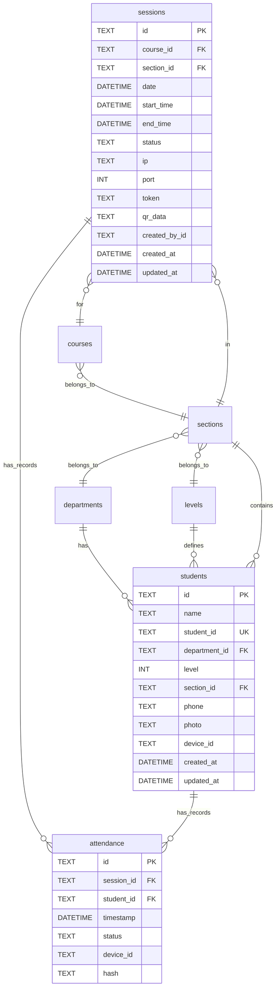

# 🗄️ توثيق قاعدة البيانات

<p align="center">
  <strong>مخطط وعلاقات قاعدة بيانات نظام الحضور الذكي</strong>
</p>

---

## 📋 جدول المحتويات

- [نظرة عامة](#-نظرة-عامة)
- [التقنيات المستخدمة](#-التقنيات-المستخدمة)
- [الجداول](#-الجداول)
  - [students (الطلاب)](#1--students-الطلاب)
  - [attendance (سجلات الحضور)](#2--attendance-سجلات-الحضور)
  - [sessions (الجلسات)](#3--sessions-الجلسات)
  - [departments (الأقسام)](#4--departments-الأقسام)
  - [levels (المستويات)](#5--levels-المستويات)
  - [sections (الشعب)](#6--sections-الشعب)
  - [courses (المقررات)](#7--courses-المقررات)
  - [settings (الإعدادات)](#8--settings-الإعدادات)
  - [logs (السجل)](#9--logs-السجل)
  - [backup (النسخ الاحتياطية)](#10--backup-النسخ-الاحتياطية)
- [ER Diagram](#-er-diagram)
- [العلاقات](#-العلاقات)
- [الفهارس](#-الفهارس)
- [الاستعلامات الشائعة](#-الاستعلامات-الشائعة)

---

## 👁️ نظرة عامة

تستخدم قاعدة البيانات **SQLite** عبر مكتبة **Drift** (سابقاً Moor) لتخزين جميع البيانات محلياً على الجهاز. تم تصميم القاعدة لتدعم:

- ✅ التخزين المحلي الكامل (Offline-first)
- ✅ العلاقات بين الجداول
- ✅ فهرسة سريعة للبحث
- ✅ دعم الترحيل والنسخ الاحتياطي
- ✅ سلامة البيانات (Data Integrity)

### معلومات قاعدة البيانات

| الخاصية | القيمة |
|---------|--------|
| **اسم الملف** | `attendance_admin.db` |
| **الموقع** | `{app_documents}/attendance_admin.db` |
| **إصدار Schema** | 1 |
| **محرك** | SQLite 3 |
| **ORM** | Drift 2.x |

---

## 🛠️ التقنيات المستخدمة

```
┌─────────────────────────────────────┐
│           Application Layer         │
├─────────────────────────────────────┤
│            Drift ORM                │
├─────────────────────────────────────┤
│           SQLite Engine             │
├─────────────────────────────────────┤
│          File System                │
│   attendance_admin.db               │
└─────────────────────────────────────┘
```

---

## 📊 الجداول

---

### 1. 🎓 students (الطلاب)

جدول تخزين بيانات الطلاب المسجلين في النظام.

#### مخطط الجدول

| العمود | النوع | القيود | الوصف |
|--------|------|--------|-------|
| `id` | TEXT | PK, Default: '' | المعرف الفريد للطالب |
| `name` | TEXT | NOT NULL, Length: 2-100 | اسم الطالب الكامل |
| `student_id` | TEXT | UNIQUE, NOT NULL | الرقم الأكاديمي/الجامعي |
| `department_id` | TEXT | FK, Nullable | معرف القسم |
| `level` | INTEGER | Nullable | المستوى الدراسي (1-4) |
| `section_id` | TEXT | FK, Nullable | معرف الشعبة |
| `phone` | TEXT | Nullable | رقم الهاتف |
| `photo` | TEXT | Nullable | مسار صورة الطالب |
| `device_id` | TEXT | Nullable | معرف جهاز الطالب |
| `created_at` | DATETIME | NOT NULL, Default: NOW | تاريخ الإنشاء |
| `updated_at` | DATETIME | Nullable | تاريخ آخر تحديث |

#### Primary Key

```sql
PRIMARY KEY (id)
```

#### Unique Constraints

```sql
UNIQUE (student_id)
```

#### مثال بيانات

| id | name | student_id | department_id | level | section_id |
|----|------|------------|---------------|-------|------------|
| stu_001 | أحمد محمد علي | STU20240001 | dept_001 | 3 | sec_001 |
| stu_002 | فاطمة خالد | STU20240002 | dept_001 | 2 | sec_002 |

#### SQL Definition (Drift)

```dart
class Students extends Table {
  TextColumn get id => text().withDefault(const Constant(''))();
  TextColumn get name => text().withLength(min: 2, max: 100)();
  TextColumn get studentId => text().unique()();
  TextColumn? get departmentId => text().nullable()();
  IntColumn? get level => integer().nullable()();
  TextColumn? get sectionId => text().nullable()();
  TextColumn? get phone => text().nullable()();
  TextColumn? get photo => text().nullable()();
  TextColumn? get deviceId => text().nullable()();
  DateTimeColumn get createdAt => dateTime().withDefault(currentDateAndTime)();
  DateTimeColumn get updatedAt => dateTime().withDefault(currentDateAndTime).nullable()();

  @override
  Set<Column> get primaryKey => {id};
}
```

---

### 2. ✅ attendance (سجلات الحضور)

جدول تسجيل سجلات حضور الطلاب في الجلسات المختلفة.

#### مخطط الجدول

| العمود | النوع | القيود | الوصف |
|--------|------|--------|-------|
| `id` | TEXT | PK, Default: '' | المعرف الفريد للتسجيل |
| `session_id` | TEXT | FK, NOT NULL | معرف الجلسة |
| `student_id` | TEXT | FK, NOT NULL | معرف الطالب |
| `timestamp` | DATETIME | NOT NULL, Default: NOW | وقت تسجيل الحضور |
| `status` | TEXT | NOT NULL, Default: 'present' | حالة الحضور |
| `device_id` | TEXT | Nullable | معرف الجهاز المستخدم |
| `hash` | TEXT | Nullable | تجربة التحقق من البيانات |

#### الحالات الممكنة للحضور (`status`)

| القيمة | الوصف |
|--------|-------|
| `present` | حاضر |
| `absent` | غائب |
| `late` | متأخر |
| `excused` | بعذر |

#### Primary Key & Unique Constraints

```sql
PRIMARY KEY (id)

UNIQUE (session_id, student_id)  -- منع التسجيل المكرر
```

#### مثال بيانات

| id | session_id | student_id | timestamp | status |
|----|------------|------------|-----------|--------|
| att_001 | sess_001 | stu_001 | 2024-01-15 09:30:00 | present |
| att_002 | sess_001 | stu_002 | 2024-01-15 09:35:00 | late |

#### SQL Definition (Drift)

```dart
class AttendanceRecords extends Table {
  TextColumn get id => text().withDefault(const Constant(''))();
  TextColumn get sessionId => text()();
  TextColumn get studentId => text()();
  DateTimeColumn get timestamp => dateTime().withDefault(currentDateAndTime)();
  TextColumn get status => text().withDefault(const Constant('present'))();
  TextColumn? get deviceId => text().nullable()();
  TextColumn? get hash => text().nullable()();

  @override
  Set<Column> get primaryKey => {id};

  @override
  List<Set<Column>> get uniqueKeys => [
    {sessionId, studentId},
  ];
}
```

---

### 3. 📡 sessions (الجلسات)

جدول جلسات الحضور التي ينشئها المسؤول.

#### مخطط الجدول

| العمود | النوع | القيود | الوصف |
|--------|------|--------|-------|
| `id` | TEXT | PK, Default: '' | المعرف الفريد للجلسة |
| `course_id` | TEXT | FK, NOT NULL | معرف المقرر |
| `section_id` | TEXT | FK, NOT NULL | معرف الشعبة |
| `date` | DATETIME | NOT NULL | تاريخ الجلسة |
| `start_time` | DATETIME | NOT NULL | وقت البدء |
| `end_time` | DATETIME | Nullable | وقت الانتهاء |
| `status` | TEXT | NOT NULL, Default: 'created' | حالة الجلسة |
| `ip` | TEXT | Nullable | عنوان IP للخادم |
| `port` | INTEGER | Nullable | رقم المنفذ |
| `token` | TEXT | Nullable | توكن المصادقة |
| `qr_data` | TEXT | Nullable | بيانات رمز QR |
| `created_by_id` | TEXT | Nullable | معرف المنشئ |
| `created_at` | DATETIME | NOT NULL, Default: NOW | تاريخ الإنشاء |
| `updated_at` | DATETIME | Nullable | تاريخ آخر تحديث |

#### حالات الجلسة (`status`)

| القيمة | الوصف |
|--------|-------|
| `created` | تم الإنشاء (لم تبدأ بعد) |
| `active` | نشطة (الخادم يعمل) |
| `paused` | مؤقتة (متوقفة مؤقتاً) |
| `closed` | مغلقة (انتهت) |

#### مثال بيانات

| id | course_id | section_id | date | start_time | status | token |
|----|-----------|------------|------|------------|--------|-------|
| sess_001 | crs_001 | sec_001 | 2024-01-15 | 2024-01-15 09:00:00 | active | abc123xyz |

#### SQL Definition (Drift)

```dart
class Sessions extends Table {
  TextColumn get id => text().withDefault(const Constant(''))();
  TextColumn get courseId => text()();
  TextColumn get sectionId => text()();
  DateTimeColumn get date => dateTime()();
  DateTimeColumn get startTime => dateTime()();
  DateTimeColumn? get endTime => dateTime().nullable()();
  TextColumn get status => text().withDefault(const Constant('created'))();
  TextColumn? get ip => text().nullable()();
  IntColumn? get port => integer().nullable()();
  TextColumn? get token => text().nullable()();
  TextColumn? get qrData => text().nullable()();
  TextColumn? get createdById => text().nullable()();
  DateTimeColumn get createdAt => dateTime().withDefault(currentDateAndTime)();
  DateTimeColumn get updatedAt => dateTime().withDefault(currentDateAndTime).nullable()();

  @override
  Set<Column> get primaryKey => {id};
}
```

---

### 4. 🏛️ departments (الأقسام)

جدول الأقسام الدراسية في المؤسسة التعليمية.

#### مخطط الجدول

| العمود | النوع | القيود | الوصف |
|--------|------|--------|-------|
| `id` | TEXT | PK, Default: '' | المعرف الفريد |
| `name` | TEXT | NOT NULL, Length: 2-100 | اسم القسم |
| `code` | TEXT | Nullable | رمز القسم |
| `created_at` | DATETIME | NOT NULL, Default: NOW | تاريخ الإنشاء |

#### مثال بيانات

| id | name | code |
|----|------|------|
| dept_001 | علوم الحاسب | CS |
| dept_002 | هندسة البرمجيات | SE |
| dept_003 | نظم المعلومات | IS |

#### SQL Definition (Drift)

```dart
class Departments extends Table {
  TextColumn get id => text().withDefault(const Constant(''))();
  TextColumn get name => text().withLength(min: 2, max: 100)();
  TextColumn? get code => text().nullable()();
  DateTimeColumn get createdAt => dateTime().withDefault(currentDateAndTime)();

  @override
  Set<Column> get primaryKey => {id};
}
```

---

### 5. 📚 levels (المستويات)

جدول المستويات الدراسية.

#### مخطط الجدول

| العمود | النوع | القيود | الوصف |
|--------|------|--------|-------|
| `id` | TEXT | PK, Default: '' | المعرف الفريد |
| `name` | TEXT | NOT NULL | اسم المستوى |
| `code` | TEXT | Nullable | رمز المستوى |
| `order` | INTEGER | Nullable | ترتيب العرض |
| `created_at` | DATETIME | NOT NULL, Default: NOW | تاريخ الإنشاء |

#### البيانات الافتراضية

| id | name | code | order |
|----|------|------|-------|
| level_1 | المستوى الأول | L1 | 1 |
| level_2 | المستوى الثاني | L2 | 2 |
| level_3 | المستوى الثالث | L3 | 3 |
| level_4 | المستوى الرابع | L4 | 4 |

#### SQL Definition (Drift)

```dart
class Levels extends Table {
  TextColumn get id => text().withDefault(const Constant(''))();
  TextColumn get name => text()();
  TextColumn? get code => text().nullable()();
  IntColumn? get order => integer().nullable()();
  DateTimeColumn get createdAt => dateTime().withDefault(currentDateAndTime)();

  @override
  Set<Column> get primaryKey => {id};
}
```

---

### 6. 👥 sections (الشعب)

جدول الشعب أو الفصول الدراسية.

#### مخطط الجدول

| العمود | النوع | القيود | الوصف |
|--------|------|--------|-------|
| `id` | TEXT | PK, Default: '' | المعرف الفريد |
| `name` | TEXT | NOT NULL, Length: 2-100 | اسم الشعبة |
| `level_id` | TEXT | FK, Nullable | معرف المستوى |
| `department_id` | TEXT | FK, Nullable | معرف القسم |
| `created_at` | DATETIME | NOT NULL, Default: NOW | تاريخ الإنشاء |

#### مثال بيانات

| id | name | level_id | department_id |
|----|------|----------|---------------|
| sec_001 | الشعبة أ | level_3 | dept_001 |
| sec_002 | الشعبة ب | level_3 | dept_001 |

#### SQL Definition (Drift)

```dart
class Sections extends Table {
  TextColumn get id => text().withDefault(const Constant(''))();
  TextColumn get name => text().withLength(min: 2, max: 100)();
  TextColumn? get levelId => text().nullable()();
  TextColumn? get departmentId => text().nullable()();
  DateTimeColumn get createdAt => dateTime().withDefault(currentDateAndTime)();

  @override
  Set<Column> get primaryKey => {id};
}
```

---

### 7. 📖 courses (المقررات)

جدول المواد或 المقررات الدراسية.

#### مخطط الجدول

| العمود | النوع | القيود | الوصف |
|--------|------|--------|-------|
| `id` | TEXT | PK, Default: '' | المعرف الفريد |
| `name` | TEXT | NOT NULL, Length: 2-100 | اسم المقرر |
| `code` | TEXT | Nullable | رمز المقرر |
| `section_id` | TEXT | FK, Nullable | معرف الشعبة |
| `created_at` | DATETIME | NOT NULL, Default: NOW | تاريخ الإنشاء |

#### مثال بيانات

| id | name | code | section_id |
|----|------|------|------------|
| crs_001 | برمجة متقدمة | CS301 | sec_001 |
| crs_002 | قواعد بيانات | CS302 | sec_001 |

#### SQL Definition (Drift)

```dart
class Courses extends Table {
  TextColumn get id => text().withDefault(const Constant(''))();
  TextColumn get name => text().withLength(min: 2, max: 100)();
  TextColumn? get code => text().nullable()();
  TextColumn? get sectionId => text().nullable()();
  DateTimeColumn get createdAt => dateTime().withDefault(currentDateAndTime)();

  @override
  Set<Column> get primaryKey => {id};
}
```

---

### 8. ⚙️ settings (الإعدادات)

جدول تخزين إعدادات التطبيق (Key-Value Store).

#### مخطط الجدول

| العمود | النوع | القيود | الوصف |
|--------|------|--------|-------|
| `key` | TEXT | PK, NOT NULL | مفتاح الإعداد |
| `value` | TEXT | NOT NULL | قيمة الإعداد |
| `type` | TEXT | NOT NULL, Default: 'string' | نوع القيمة |
| `updated_at` | DATETIME | Nullable | تاريخ آخر تحديث |

#### أنواع القيم (`type`)

| القيمة | الوصف |
|--------|-------|
| `string` | نص |
| `integer` | عدد صحيح |
| `boolean` | منطقي (true/false) |
| `json` | بيانات JSON |

#### الإعدادات المخزنة

| key | type | الوصف |
|-----|------|-------|
| `password_hash` | string | تجزئة كلمة المرور |
| `server_port` | integer | رقم منفذ الخادم |
| `is_dark_mode` | boolean | وضع داكن |
| `language` | string | لغة التطبيق |
| `auto_backup` | boolean | نسخ احتياطي تلقائي |
| `last_backup_time` | datetime | آخر نسخة احتياطية |

#### SQL Definition (Drift)

```dart
class SettingsTable extends Table {
  TextColumn get key => text()();
  TextColumn get value => text()();
  TextColumn get type => text().withDefault(const Constant('string'))();
  DateTimeColumn get updatedAt => dateTime().withDefault(currentDateAndTime).nullable()();

  @override
  Set<Column> get primaryKey => {key};
}
```

---

### 9. 📝 logs (السجل)

جدول تسجيل الأنشطة والأحداث في النظام.

#### مخطط الجدول

| العمود | النوع | القيود | الوصف |
|--------|------|--------|-------|
| `id` | TEXT | PK, Default: '' | المعرف الفريد |
| `action` | TEXT | NOT NULL | نوع الإجراء |
| `entity_type` | TEXT | NOT NULL | نوع الكيان |
| `entity_id` | TEXT | Nullable | معرف الكيان |
| `details` | TEXT | Nullable | تفاصيل إضافية |
| `user_id` | TEXT | Nullable | معرف المستخدم |
| `timestamp` | DATETIME | NOT NULL, Default: NOW | وقت الحدث |

#### أنواع الإجراءات (`action`)

| القيمة | الوصف |
|--------|-------|
| `create` | إنشاء |
| `update` | تحديث |
| `delete` | حذف |
| `login` | تسجيل دخول |
| `logout` | تسجيل خروج |
| `export` | تصدير |
| `import` | استيراد |
| `backup` | نسخ احتياطي |
| `restore` | استعادة |

#### أنواع الكيانات (`entity_type`)

| القيمة | الوصف |
|--------|-------|
| `student` | طالب |
| `session` | جلسة |
| `attendance` | سجل حضور |
| `course` | مقرر |
| `section` | شعبة |
| `department` | قسم |
| `settings` | إعدادات |

#### SQL Definition (Drift)

```dart
class Logs extends Table {
  TextColumn get id => text().withDefault(const Constant(''))();
  TextColumn get action => text()();
  TextColumn get entityType => text()();
  TextColumn? get entityId => text().nullable()();
  TextColumn? get details => text().nullable()();
  TextColumn? get userId => text().nullable()();
  DateTimeColumn get timestamp => dateTime().withDefault(currentDateAndTime)();

  @override
  Set<Column> get primaryKey => {id};
}
```

---

### 10. 💾 backup (النسخ الاحتياطية)

جدول تسجيل عمليات النسخ الاحتياطي.

#### مخطط الجدول

| العمود | النوع | القيود | الوصف |
|--------|------|--------|-------|
| `id` | TEXT | PK, Default: '' | المعرف الفريد |
| `file_path` | TEXT | NOT NULL | مسار ملف النسخة |
| `size` | INTEGER | NOT NULL | حجم الملف (بايت) |
| `records_count` | INTEGER | NOT NULL | عدد السجلات |
| `description` | TEXT | Nullable | وصف النسخة |
| `created_at` | DATETIME | NOT NULL, Default: NOW | تاريخ الإنشاء |

#### مثال بيانات

| id | file_path | size | records_count | description |
|----|-----------|------|---------------|-------------|
| bak_001 | /path/to/backup_20240115.backup | 5242880 | 150 | نسخة يومية |

#### SQL Definition (Drift)

```dart
class Backups extends Table {
  TextColumn get id => text().withDefault(const Constant(''))();
  TextColumn get filePath => text()();
  IntColumn get size => integer()();
  IntColumn get recordsCount => integer()();
  DateTimeColumn get createdAt => dateTime().withDefault(currentDateAndTime)();
  TextColumn? get description => text().nullable()();

  @override
  Set<Column> get primaryKey => {id};
}
```

---

## 🔗 ER Diagram

### رسم توضيحي نصي

```
┌─────────────────┐       ┌──────────────────┐       ┌─────────────────┐
│    departments   │       │      levels       │       │     sections     │
├─────────────────┤       ├──────────────────┤       ├─────────────────┤
│ *id (PK)        │       │ *id (PK)          │       │ *id (PK)         │
│  name           │       │  name             │       │  name            │
│  code           │       │  code             │       │  level_id (FK) ──┼──────┐
│  created_at     │       │  order            │       │  department_id ───┼──┐   │
└─────────────────┘       │  created_at       │       │  created_at      │  │   │
                          └──────────────────┘       └─────────────────┘  │   │
                                                                │           │
                                ┌───────────────────────────────┘           │
                                │                                           │
                                ▼                                           ▼
                         ┌─────────────┐                           ┌─────────────┐
                         │   students   │                           │   courses    │
                         ├─────────────┤                           ├─────────────┤
                         │ *id (PK)     │                           │ *id (PK)     │
                         │  name        │                           │  name        │
                         │  student_id  │◄── UNIQUE                 │  code        │
                         │  dept_id(FK)─┼───────────────────────────│  section_id ─┼┘
                         │  level       │                           │  created_at  │
                         │  section_id ─┼───────────────────────────┴─────────────┘
                         │  phone       │
                         │  photo       │
                         │  device_id   │
                         │  created_at  │
                         │  updated_at  │
                         └──────┬───────┘
                                │
                    ┌───────────┼───────────┐
                    │           │           │
                    ▼           ▼           ▼
           ┌─────────────┐ ┌──────────┐ ┌───────────┐
           │  attendance  │ │ sessions │ │   logs    │
           ├─────────────┤ ├──────────┤ ├───────────┤
           │ *id (PK)     │ │*id (PK)  │ │ *id (PK)  │
           │ session_id ──┼─┤course_id │ │ action    │
           │ student_id ──┘ │section_id│ │entity_type│
           │ timestamp     │ │date      │ │entity_id  │
           │ status        │ │start_time│ │details    │
           │ device_id     │ │end_time  │ │user_id    │
           │ hash          │ │status    │ │timestamp  │
           └───────────────┘ │ip        │ └───────────┘
                              │port      │
                              │token     │
                              │qr_data   │
                              │created_at│
                              └────┬─────┘
                                   │
                    ┌──────────────┼──────────────┐
                    ▼              ▼              ▼
              ┌───────────┐ ┌───────────┐ ┌────────────┐
              │ settings  │ │  backup   │ │ (other)    │
              ├───────────┤ ├───────────┤ └────────────┘
              │ *key (PK) │ │ *id (PK)  │
              │ value     │ │ file_path │
              │ type      │ │ size      │
              │ updated_at│ │records_cnt│
              └───────────┘ │ created_at│
                             │ description│
                             └────────────┘
```

### علاقات الجداول (Mermaid)



---

## 🔗 العلاقات

### ملخص العلاقات

| الجدول المصدر | الجدول الهدف | نوع العلاقة | العمود |
|--------------|-------------|-------------|--------|
| `students` | `departments` | Many-to-One | `department_id` → `id` |
| `students` | `levels` | Many-to-One | `level` → `id` |
| `students` | `sections` | Many-to-One | `section_id` → `id` |
| `attendance` | `sessions` | Many-to-One | `session_id` → `id` |
| `attendance` | `students` | Many-to-One | `student_id` → `id` |
| `sessions` | `courses` | Many-to-One | `course_id` → `id` |
| `sessions` | `sections` | Many-to-One | `section_id` → `id` |
| `sections` | `levels` | Many-to-One | `level_id` → `id` |
| `sections` | `departments` | Many-to-One | `department_id` → `id` |
| `courses` | `sections` | Many-to-One | `section_id` → `id` |

### تفصيل العلاقات

```
┌─────────────────────────────────────────────────────────────────────┐
│                        علاقات Many-to-One                            │
├─────────────────────────────────────────────────────────────────────┤
│                                                                     │
│   departments (1) ─────────────< (N) students                        │
│   levels (1)       ─────────────< (N) students                       │
│   sections (1)     ─────────────< (N) students                       │
│                                                                     │
│   sessions (1)     ─────────────< (N) attendance                     │
│   students (1)     ─────────────< (N) attendance                     │
│                                                                     │
│   courses (1)      ─────────────< (N) sessions                       │
│   sections (1)     ─────────────< (N) sessions                       │
│                                                                     │
│   levels (1)       ─────────────< (N) sections                       │
│   departments (1)  ─────────────< (N) sections                       │
│                                                                     │
│   sections (1)     ─────────────< (N) courses                        │
│                                                                     │
└─────────────────────────────────────────────────────────────────────┘
```

---

## 📑 الفهارس (Indexes)

### الفهارس المقترحة

لتحسين أداء الاستعلامات، يُنصح بإضافة الفهارس التالية:

```sql
-- للبحث السريع عن طلاب
CREATE INDEX idx_students_name ON students(name);
CREATE INDEX idx_students_student_id ON students(student_id);

-- لاستعلامات الحضور
CREATE INDEX idx_attendance_session ON attendance(session_id);
CREATE INDEX idx_attendance_student ON attendance(student_id);
CREATE INDEX idx_attendance_timestamp ON attendance(timestamp);

-- لاستعلامات الجلسات
CREATE INDEX idx_sessions_status ON sessions(status);
CREATE INDEX idx_sessions_date ON sessions(date);

-- للسجل
CREATE INDEX idx_logs_timestamp ON logs(timestamp);
CREATE INDEX idx_logs_action ON logs(action);

-- للشعب
CREATE INDEX idx_sections_department ON sections(department_id);
CREATE INDEX idx_sections_level ON sections(level_id);
```

---

## 🔍 الاستعلامات الشائعة

### 1. الحصول على جميع الطلاب مع معلوماتهم

```dart
// Drift Query
Future<List<StudentWithDetails>> getAllStudentsWithDetails() {
  final query = select(students).join([
    leftOuterJoin(departments, departments.id.equalsExp(students.departmentId)),
    leftOuterJoin(sections, sections.id.equalsExp(students.sectionId)),
    leftOuterJoin(levels, levels.id.equalsExp(students.level)),
  ]);
  return query.get();
}
```

### 2. حضور جلسة معينة مع أسماء الطلاب

```dart
Future<List<AttendanceWithStudent>> getSessionAttendance(String sessionId) {
  final query = select(attendanceRecords).join([
    innerJoin(students, students.id.equalsExp(attendanceRecords.studentId)),
  ])
    ..where(attendanceRecords.sessionId.equals(sessionId))
    ..orderBy([OrderingTerm(attendanceRecords.timestamp)]);
  
  return query.get();
}
```

### 3. إحصائيات لوحة التحكم

```dart
Future<DashboardStatistics> getDashboardStats() async {
  final totalStudents = await students.count().getSingle();
  final activeSessions = await customSelect(
    'SELECT COUNT(*) as count FROM sessions WHERE status = ?',
    variables: [Variable.withString('active')],
  ).getSingle();
  
  // ... المزيد من الاستعلامات
  
  return DashboardStatistics(
    totalStudents: totalStudents,
    activeSessions: activeSessions.read('count') ?? 0,
    // ...
  );
}
```

### 4. البحث عن طالب

```dart
Future<List<Student>> searchStudents(String query) {
  final pattern = '%$query%';
  return (select(students)
    ..where((t) =>
      t.name.like(pattern) |
      t.studentId.like(pattern))
  ).get();
}
```

### 5. سجل حضور طالب

```dart
Future<List<AttendanceRecord>> getStudentHistory(String studentId) {
  return (select(attendanceRecords)
    ..where((t) => t.studentId.equals(studentId))
    ..orderBy([(t) => OrderingTerm.desc(t.timestamp)])
  ).get();
}
```

---

## 📊 إحصائيات قاعدة البيانات

| الجدول | التقدير الأولي | النمو المتوقع |
|--------|---------------|---------------|
| `students` | 50-500 سجل | +50/فصل دراسي |
| `attendance` | 1000+ سجل | +1000/أسبوع |
| `sessions` | 5-20/أسبوع | - |
| `departments` | 5-20 | نادراً |
| `levels` | 4 | ثابت |
| `sections` | 10-50 | نادراً |
| `courses` | 10-30 | كل فصل |
| `settings` | 10-20 | ثابت تقريباً |
| `logs` | 1000+ | مستمر |
| `backup` | 10-50 | أسبوعي |

---

## 🔄 Migration Strategy

عند تغيير Schema، استخدم:

```dart
@override
MigrationStrategy get migration {
  return MigrationStrategy(
    onCreate: (Migrator m) async {
      await m.createAll();
      await _seedInitialData();
    },
    onUpgrade: (Migrator m, int from, int to) async {
      for (var version = from + 1; version <= to; version++) {
        switch (version) {
          case 2:
            // تعديلات الإصدار 2
            break;
          case 3:
            // تعديلات الإصدار 3
            break;
        }
      }
    },
  );
}
```

---

<p align="center">
  <strong>🗄️ انتهى توثيق قاعدة البيانات</strong>
</p>
